# 🐶 HEKA 寵物 — 動畫需求審片室（V03：Jack Russell Terrier）

**▶ 線上審片室：<https://terry12260201.github.io/heka-pet-review/>**

> **V03（2026-10-07）**：主角換成素材包 **Cartoon_JRTerrier**。這一版不是在做動畫，是把「企劃要的動作」和「素材包已有的動畫」對起來，看還缺什麼。
>
> - **需求對照 43 項**：素材包現成 14、部分可用 15、素材包沒有 14。來源分三種標籤：企劃（25 項）、南瓜指定補充（5 項：床上睡覺、跑步、走路、原地打滾、全身抖毛）、Claude 建議補充（13 項）。
> - **素材包全部 115 支**：114 支原地版動畫＋從 Beagle 移植的全身抖毛。每支有中文名、分類、照護情境適不適合（攻擊、受擊、尿尿等 13 支標「不建議」）。
> - **生產線 29 項**：所有「部分可用」與「素材包沒有」的需求，從「提需求」開始排。
> - **毛色 1–4 切換**、需求直達連結 `#req=<代號>`、兩份盤點 CSV（可貼進 Google Sheets 對 Jira）。
> - ⚠️ **需求來源**：Jira FOOT-27 的動作表還沒讀進來，企劃類需求暫依 HEKA 寵物企劃整理，標「待 Jira 核對」。
>
> **改需求**：編輯 `tools/reqs.py` → `python3 tools/build_data.py .` → `node tools/build_status.js "<時間>"`。
> **重做模型或縮圖**：`tools/build_glb_blender.py`、`tools/thumbs_blender.py`（Blender 背景模式）。
> **同骨架移植動畫**：`tools/retarget_same_rig.py`（Beagle 與 JRTerrier 是同一套 57 根骨頭）。
>
> 上一版 Beagle 審片室（V02）整包移到 [`v02-beagle/`](v02-beagle/)：<https://terry12260201.github.io/heka-pet-review/v02-beagle/>。舊的 `#clip=` 連結會自動導過去。

---

# V02 紀錄：Beagle 3D 模型與動畫審片室

> 以下是 V02 的說明，檔案都已移到 `v02-beagle/` 底下。

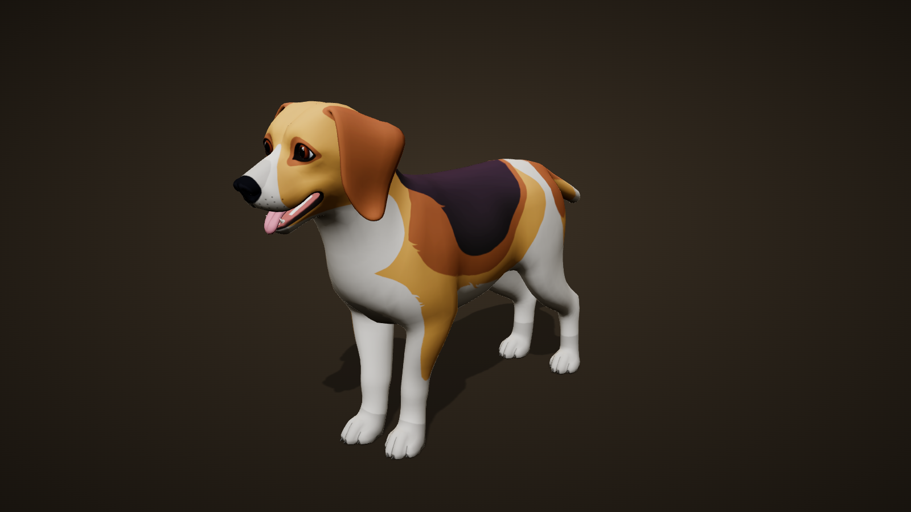


這個 repo 是 **HEKA 寵物（AI 數位陪伴）** 的 Beagle 小獵犬 3D 動畫測試，用 **Claude + Blender** 做動畫，最後放上一個瀏覽器就能看的 3D 審片室。

裡面包含一隻已綁好骨架的卡通 Beagle，共 **27 段動畫**：26 段新做的互動動作，加上素材包原有的待機動作 `Idle_1`。

**▶ 線上審片室：<https://terry12260201.github.io/heka-pet-review/>**

> **V02（2026-10-04）**：審片室改用[南瓜墨金美學](https://github.com/terry12260201/pumpkin-ink-gold)重做，分成「動畫／生產線／下載／怎麼用」四個分頁，新增**生產線看板**（每支動畫走到提需求→生影片→對骨架→待驗收→通過的哪一站）與日夜模式。舊版深色介面保留在 git tag `v1-dark`。
>
> 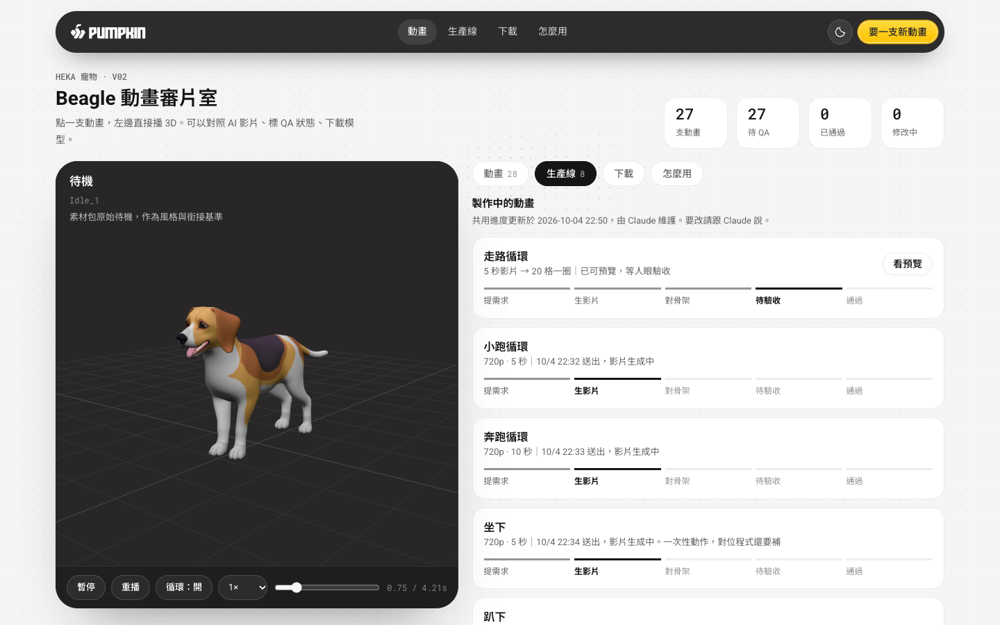
>
> **同日更新**：新增第 28 段動畫 `Walk_AIVideo_Loop`（走路循環）。這支不是手 K，是照 AI 生成的側面影片逐格對骨架做出來的，做法與程式在 [ai-video-to-bones](https://github.com/terry12260201/ai-video-to-bones)。直接看這一支：<https://terry12260201.github.io/heka-pet-review/#clip=Walk_AIVideo_Loop>，按「🎞 對照 AI 影片」可以跟原影片並排比。
>
> 審片室同時加了：模型下載區、共用 QA 狀態（`status.json`）、角色清單、「跟 Claude 說什麼」咒語區。`beagle.glb` 與 `.blend` 已含 28 段；`.fbx` 仍是 27 段，尚未含走路循環。

## 🤝 同事怎麼用

| 你想做的事 | 怎麼做 |
|---|---|
| 看現在做到哪 | 打開審片室，點右側任一支動畫，左邊 3D 直接播 |
| 下載模型 | 審片室往下捲到「下載」 |
| 標 QA 結果讓大家看到 | 跟 Claude 說「把〈動畫名〉標成 QA 通過／修改中，備註…」，它會改 `status.json` 並推上來 |
| 要一支新動畫 | 複製審片室最下面「做一支新動畫」那句貼給 Claude |
| 加新角色 | 複製「加新角色」那句貼給 Claude |

你在網頁上直接改的狀態只存在自己的瀏覽器；`status.json` 才是大家共用的那份。

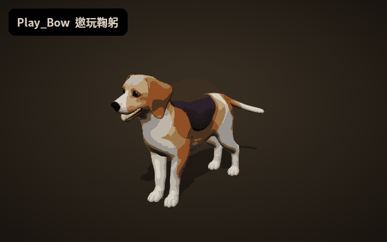

---

## 📦 模型檔案下載

| 檔案 | 格式 | 給誰用 | 大小 |
|---|---|---|---|
| [`model/Beagle_HEKA.blend`](v02-beagle/model/Beagle_HEKA.blend) | Blender 5.1 | 美術：直接打開編修，貼圖已打包在檔案內 | 2.9 MB |
| [`model/Beagle_HEKA.fbx`](v02-beagle/model/Beagle_HEKA.fbx) | FBX 7.4（內嵌貼圖） | Unity／UE 匯入，27 段動畫都是獨立 Take | 13.3 MB |
| [`beagle.glb`](v02-beagle/beagle.glb) | glTF 2.0 Binary | 網頁／Three.js，審片室就是讀這一顆 | 2.3 MB |
| [`model/Cartoon_Beagle_Albedo.png`](v02-beagle/model/Cartoon_Beagle_Albedo.png) | PNG 2048×2048 | 原始顏色貼圖，可單獨修改 | 0.9 MB |

> 三個 3D 檔的內容完全相同：同一組網格、骨架和 27 段動畫。`.blend` 和 `.fbx` 是用 Blender 5.1.2 從 `beagle.glb` 轉出來的，轉完重新打開檢查過，動畫數、骨骼數和貼圖都對得上。

---

## 📐 模型規格

| 項目 | 數值 |
|---|---|
| 網格物件 | `Cartoon_Beagle`（1 個網格） |
| 頂點／三角面 | 7,156 頂點／12,510 三角面（Low-poly，適合手機與 AR） |
| 材質 | 1 個：`Cartoon_Beagle` |
| 貼圖 | 1 張 Albedo（Base Color），2048 × 2048 |
| UV | 1 組：`UVMap` |
| Shape Keys | 無（表情全部由骨骼驅動） |
| 骨架 | `Arm_Beagle`，57 根骨骼 |
| 尺寸（寬 × 長 × 高） | 約 0.19 × 0.74 × 0.49 公尺 |
| 動畫 | 27 段：P0 核心 18 段、P1 補強 8 段、參考 1 段 |
| 影格率 | 24 fps |
| 匯出工具 | Khronos glTF Blender I/O v5.1.19 |

### 四面三視圖

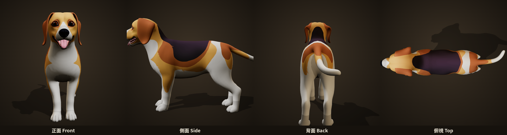

### 網格拓樸

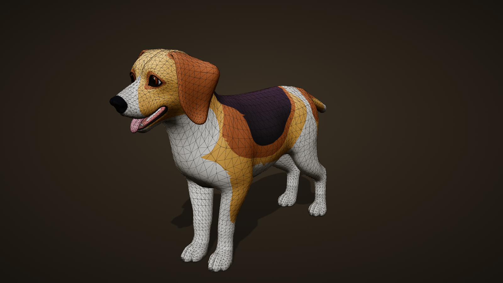

### 骨架（57 根骨骼）

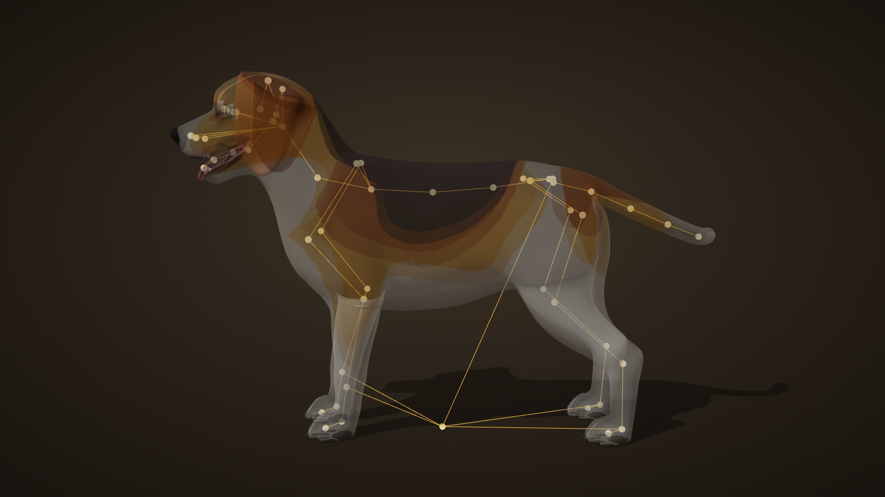

骨架結構：

- **脊椎鏈**：`Spine_base` → `Spine_02~05` → `neck` → `head`
- **頭部細節**：耳朵兩節（`Ear_01/02`）、眼睛、眼皮、嘴角、舌頭四節（`tongue_1~4`）。表情都靠這些骨骼做。
- **四肢**：前後腳都是 `hip → thigh → leg → shin → foot → claws`，每條腿 6 節。
- **尾巴**：`Tail_01~05`，共 5 節。
- **Helper 骨**：`Helper_foot_b.L/R`、`Helper_shin_f.L/R` 直接掛在 `Root_bone` 下，是 IK 輔助用的。

<details>
<summary><b>展開完整骨骼階層</b></summary>

```
Root_bone
  Spine_base
    Spine_02
      Spine_03
        Spine_04
          Spine_05
            neck
              head
                mouth
                  tongue_1
                    tongue_2
                      tongue_3
                        tongue_4
                nose
                eyelid.L
                Ear_01.L
                  Ear_02.L
                eyelid.R
                Ear_01.R
                  Ear_02.R
                Mouth.L
                Mouth.R
                eye.L
                eye.R
            hip_f.L
              thigh_f.L
                leg_f.L
                  shin_f.L
                    foot_f.L
                      claws_f.L
            hip_f.R
              thigh_f.R
                leg_f.R
                  shin_f.R
                    foot_f.R
                      claws_f.R
    Tail_01
      Tail_02
        Tail_03
          Tail_04
            Tail_05
    hip_b.L
      thigh_b.L
        leg_b.L
          shin_b.L
            foot_b.L
              claws_b.L
    hip_b.R
      thigh_b.R
        leg_b.R
          shin_b.R
            foot_b.R
              claws_b.R
  Helper_foot_b.L
  Helper_foot_b.R
  Helper_shin_f.L
  Helper_shin_f.R
```

</details>

### 貼圖

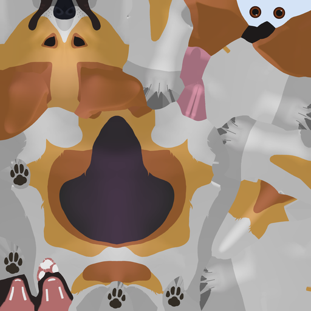

---

## 🎬 動畫清單（27 段）

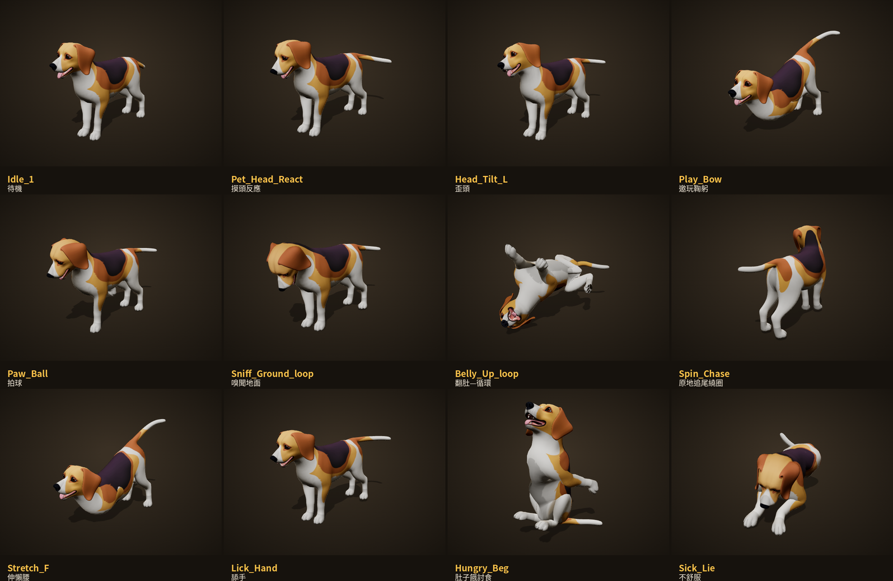

🔁 = 可循環播放。`Tail_Wag_Fast` 和 `Ear_Sad_Back` 是**疊加層**動畫，只會動尾巴或耳朵，所以單獨播放時身體不動是正常的。在 Unity 裡要用 Avatar Mask 疊在主動作上。

| # | 預覽 | 動畫名稱 | 中文 | 說明 | 優先 | 影格 | 秒數 |
|:-:|:-:|---|---|---|:-:|:-:|:-:|
| 00 | 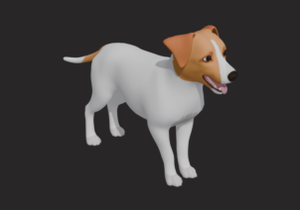 | `Idle_1` 🔁 | **待機** | 素材包原始待機，作為風格與銜接基準 | 參考 | 101 | 4.21s |
| 01 | 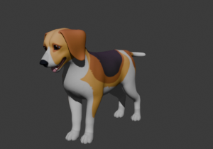 | `Pet_Head_React` | **摸頭反應** | 頭輕壓低→瞇眼→輕蹭上抬，尾巴慢搖（觸摸頭部） | P0 | 40 | 1.67s |
| 02 | 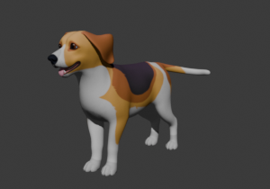 | `Pet_Ear_Flick` | **摸耳抖耳** | 單耳快速抖動兩下、微歪頭（觸摸升級鏈第 1 段） | P0 | 20 | 0.83s |
| 03 | 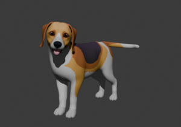 | `Pet_Turn_Look` | **回頭看玩家** | 回頭望向玩家方向、停留、轉回（升級鏈第 2 段） | P0 | 30 | 1.25s |
| 04 | 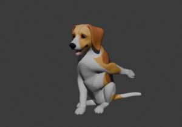 | `Pet_Paw_Block` | **擋爪** | 坐姿重心後移、抬前爪向前擋兩次（升級鏈第 3 段） | P0 | 35 | 1.46s |
| 05 | 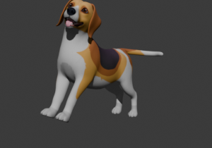 | `Pet_Back_React` | **摸背反應** | 背部拱起→壓低→輕抖→回中立（觸摸背部） | P0 | 40 | 1.67s |
| 06 | 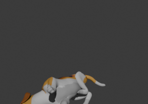 | `Belly_Up_start` | **翻肚—開始** | 從趴姿側翻至四腳朝天（摸腹部最高信任反應） | P0 | 30 | 1.25s |
| 07 | 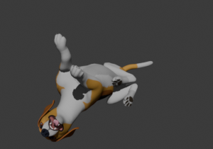 | `Belly_Up_loop` 🔁 | **翻肚—循環** | 仰躺呼吸、四肢輕蹬、尾巴擺動（可循環） | P0 | 60 | 2.50s |
| 08 | 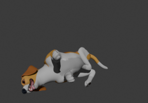 | `Belly_Up_end` | **翻肚—結束** | 翻回趴姿，接回 Lie_loop | P0 | 25 | 1.04s |
| 09 | 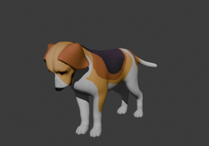 | `Sniff_Ground_loop` 🔁 | **嗅聞地面** | 低頭貼地嗅聞、鼻端點動、尾平舉（探索核心，可循環） | P0 | 50 | 2.08s |
| 10 | 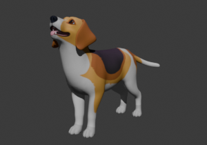 | `Sniff_Air` | **嗅聞空氣** | 抬頭 30° 聞空氣、鼻端上點、微歪頭（AR「伸手」回應） | P0 | 45 | 1.88s |
| 11 | 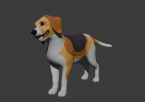 | `Head_Tilt_L` | **歪頭（左）** | 頭向左歪 25° 保持後回正（AR「傾身」回應） | P0 | 25 | 1.04s |
| 12 | 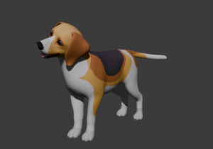 | `Head_Tilt_R` | **歪頭（右）** | 頭向右歪 25° 保持後回正（AR「傾身」回應） | P0 | 25 | 1.04s |
| 13 | 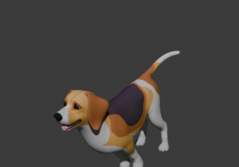 | `Play_Bow` | **邀玩鞠躬** | 前胸下壓、後軀抬高、尾快搖——犬類標準邀玩姿（AR「蹲下」回應） | P0 | 40 | 1.67s |
| 14 | 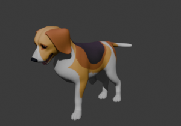 | `Paw_Ball` | **拍球** | 視線鎖定下方、單前爪向下拍兩次（玩球互動） | P0 | 30 | 1.25s |
| 15 | 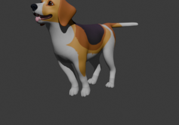 | `Spin_Celebrate` | **興奮轉圈** | 原地快速轉一圈＋小跳收尾（興奮／慶祝） | P1 | 45 | 1.88s |
| 16 | 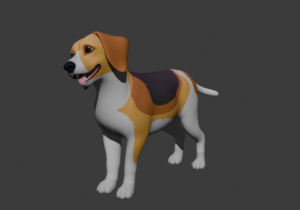 | `Body_Shake` | **全身抖毛** | 從頭到尾波浪式甩動，力道漸減（觸摸過多／睡醒） | P1 | 35 | 1.46s |
| 17 | 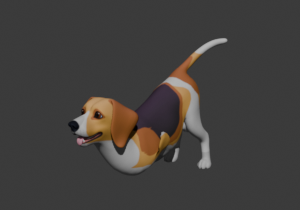 | `Stretch_F` | **伸懶腰** | 前肢前伸下壓、後軀抬高伸展後起身（睡醒必接） | P1 | 45 | 1.88s |
| 18 | 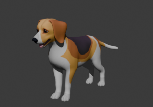 | `Head_Nod` | **點頭確認** | 點頭兩次（生活提醒完成的模仿回饋） | P1 | 20 | 0.83s |
| 19 | 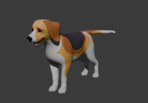 | `Lick_Hand` | **舔手** | 頭前伸、伸舌舔、尾搖（高親密度反應） | P1 | 40 | 1.67s |
| 20 | 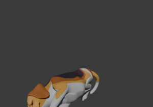 | `Sleep_Roll` | **睡中翻身** | 睡姿中翻向背側再回原位（睡眠偶發動作） | P1 | 50 | 2.08s |
| 21 | 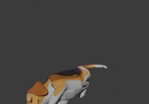 | `Tail_Wag_Fast` | **快速搖尾（加法層）** | 只動尾巴——Unity 以 Avatar Mask 疊在主動作上；單獨播放時身體不動屬正常 | P1 | 30 | 1.25s |
| 22 |  | `Ear_Sad_Back` | **委屈折耳（加法層）** | 雙耳後折＋頭微低——同為疊加層，身體不動屬正常 | P1 | 30 | 1.25s |
| 23 | 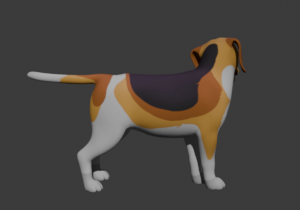 | `Spin_Chase` 🔁 | **原地追尾繞圈** | 身體弓成弧、回頭追自己尾巴轉整圈，帶小彈跳（可循環） | P0 | 60 | 2.50s |
| 24 | 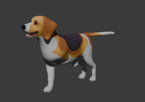 | `Beg_Play` 🔁 | **期待陪玩撒嬌** | 邀玩鞠躬扭屁股→往前撲跳→輪流抬爪討玩→再鞠躬（可循環） | P0 | 70 | 2.92s |
| 25 | 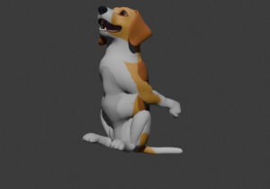 | `Hungry_Beg` 🔁 | **肚子餓討食** | 坐立起身、雙前爪舉起、抬頭盯主人、舔嘴（可循環） | P0 | 60 | 2.50s |
| 26 | 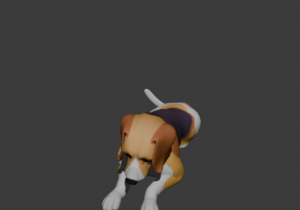 | `Sick_Lie` 🔁 | **不舒服** | 蜷縮趴臥、耳貼平、尾內收、淺呼吸帶發抖（可循環） | P0 | 90 | 3.75s |

---

## 🖥️ 審片室怎麼用

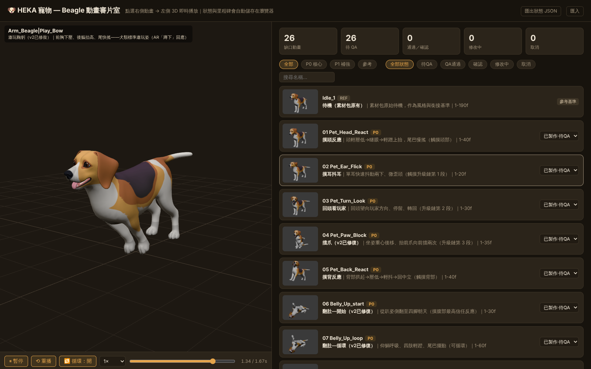

1. 打開 [線上審片室](https://terry12260201.github.io/heka-pet-review/)。
2. 點右側任一段動畫，左側的 3D 視窗就會即時播放。可以用滑鼠拖曳旋轉、滾輪縮放。
3. 下方控制列可以暫停、重播、切換循環，速度可選 0.25× 到 1.5×，也能拖時間軸逐格看。
4. 每段動畫右側的下拉選單用來標記審片狀態：待 QA → QA 通過 → 確認，或標成修改中、取消。
5. 狀態只存在**你這台瀏覽器**。換電腦或要給別人看時，用右上角的「匯出狀態 JSON」和「匯入」同步。

---

## 🛠️ 在各工具裡使用

**Blender**
- 直接打開 `model/Beagle_HEKA.blend`，27 段動畫都在 Action Editor 裡。
- 也可以用 File → Import → glTF 2.0 讀 `beagle.glb`。

**Unity**
- 把 `model/Beagle_HEKA.fbx` 拖進專案。
- Rig 頁籤選 **Generic**，不要選 Humanoid，四足動物不支援人形重定向。
- 每段動畫都是獨立 Take，名稱格式是 `Arm_Beagle|Arm_Beagle|動畫名`，可以在 Animation 頁籤裡改短。
- 疊加層動畫（`Tail_Wag_Fast`、`Ear_Sad_Back`）放到另一個 Animator Layer，搭配只勾尾巴或耳朵骨骼的 Avatar Mask。

**網頁（Three.js）**
- 用 `GLTFLoader` 讀 `beagle.glb`，再用 `AnimationMixer` 依名稱播放動畫。可以參考 [`app.js`](app.js)。

---

## 🤖 製作方式

1. **素材**：卡通 Beagle 模型和骨架來自外購素材包，`Idle_1` 是素材包原有的待機動作。
2. **需求**：依 HEKA 的互動設計（觸摸、AR 手勢回應、情緒狀態）整理出缺口動畫清單，分成 P0 和 P1。
3. **動畫**：Claude 操作 Blender（MCP／Python），在固定骨架上逐段設定關鍵影格，渲染預覽後再修正。
4. **審片**：匯出 GLB，放到這個審片室逐段驗收。

**版本紀錄**

| 版本 | 日期 | 內容 |
|---|---|---|
| v1 | 2026-07-30 | 審片室上線，22 段動畫 |
| v2 | 2026-07-30 | 修好 7 段的地面吸附問題、加強 4 段的活力，新增 4 段行為動畫（追尾、撒嬌、討食、不舒服） |
| v3 | 2026-07-30 | 全面活力化，狗不會再完全靜止 |
| v4 | 2026-10-02 | 新增 `.blend`、`.fbx`、原始貼圖、規格說明和截圖 |

---

## 📁 檔案結構

```
heka-pet-review/
├── index.html              審片室頁面
├── app.js                  3D 檢視器與清單邏輯（Three.js）
├── data.js                 動畫清單資料（名稱、說明、優先級、影格）
├── beagle.glb              模型＋27 段動畫（網頁用）
├── model/
│   ├── Beagle_HEKA.blend   Blender 檔（貼圖已打包）
│   ├── Beagle_HEKA.fbx     Unity／UE 用
│   └── Cartoon_Beagle_Albedo.png
├── thumbs/                 每段動畫的縮圖
├── docs/images/            README 用的截圖
└── vendor/                 Three.js 函式庫
```

---

## ⚠️ 注意事項

- **原始工作檔不在這裡。** 當初製作用的是 `Beagle_HEKA_WIP_02.blend`，裡面有 136 個 actions，含製作過程中的版本。這裡的 `.blend` 是從最終 GLB 重建的，只有正式的 27 段動畫。
- **授權。** 模型來自外購素材包，這個 repo 又是公開的。對外散布前，請先確認素材包的授權條款允許公開分享原始模型檔。
